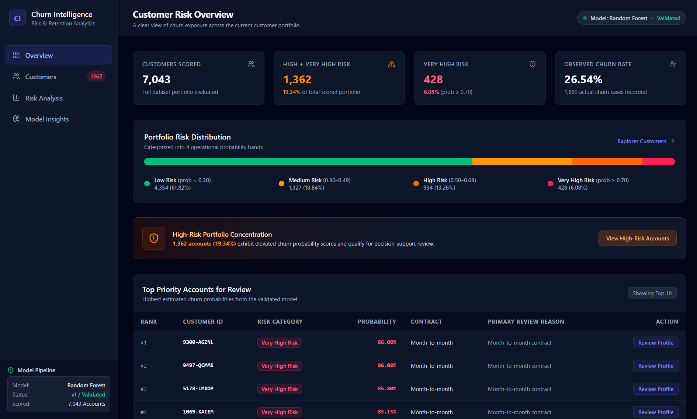
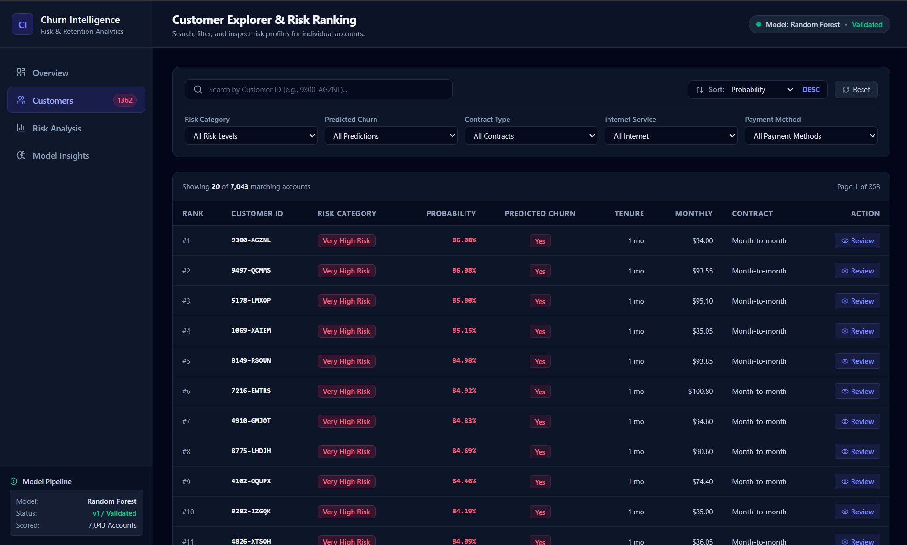
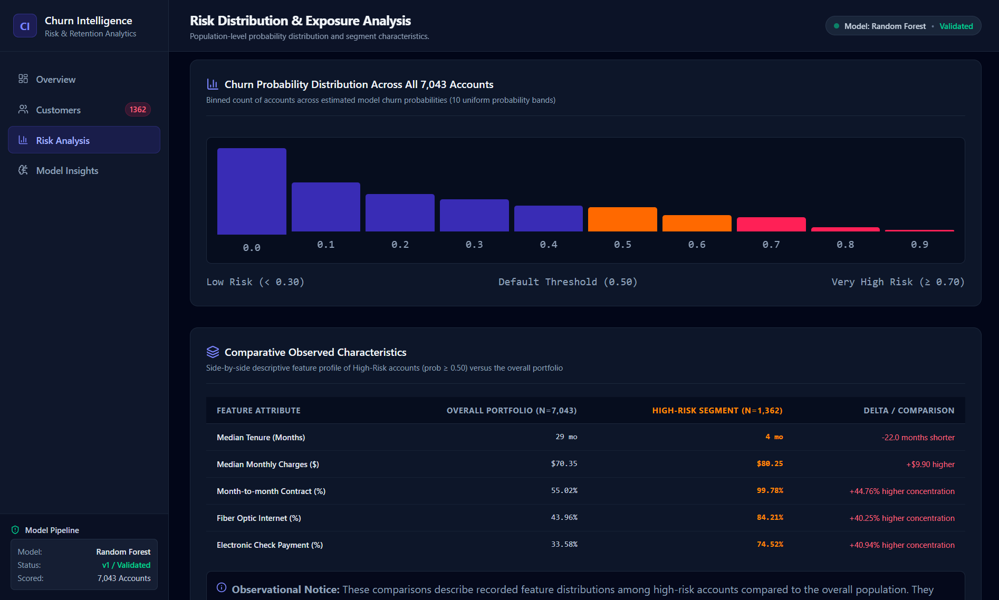
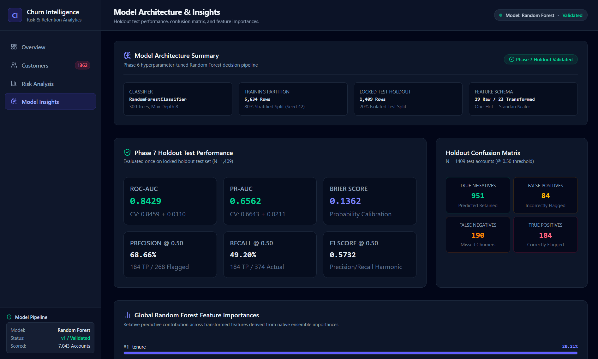

# Customer Churn Prediction & Retention Intelligence System

> A reproducible machine-learning decision-support system for predicting customer churn, ranking high-risk accounts, and providing interpretable insights for retention review.


---

## Table of Contents

* [Overview](#overview)
* [Problem Statement](#problem-statement)
* [Key Capabilities](#key-capabilities)
* [Dataset Summary](#dataset-summary)
* [Data Cleaning & Leakage Isolation](#data-cleaning--leakage-isolation)
* [Exploratory Data Analysis](#exploratory-data-analysis)
* [Feature Engineering & Ablation](#feature-engineering--ablation)
* [Model Development & Optimization](#model-development--optimization)
* [Final Holdout Evaluation Results](#final-holdout-evaluation-results)
* [Threshold Analysis](#threshold-analysis)
* [Portfolio Risk Ranking & Explainability](#portfolio-risk-ranking--explainability)
* [Decision-Support Web Application](#decision-support-web-application)
* [Application Screenshots](#application-screenshots)
* [Project Structure](#project-structure)
* [Technology Stack](#technology-stack)
* [Installation & Setup](#installation--setup)
* [Running the Application](#running-the-application)
* [Testing & Quality Assurance](#testing--quality-assurance)
* [Project Roadmap & Status](#project-roadmap--status)
* [Limitations](#limitations)
* [Documentation Links](#documentation-links)
* [License](#license)

---

## Overview

Customer churn poses a major challenge for subscription-based businesses, where acquiring a new customer is significantly more costly than retaining an existing subscriber. Identifying accounts exhibiting elevated risk of churn empowers customer success teams to prioritize proactive retention interventions.

This project delivers an end-to-end machine-learning decision-support system that analyzes historical customer account attributes and estimates churn probabilities.

Rather than producing a black-box binary label, the system provides:
* Estimated churn probabilities `P(Churn = Yes)`
* Operational risk bands (Low, Medium, High, Very High Risk)
* Ranked customer priority lists
* Evidence-based, interpretable review reasons for customer success teams
* Interactive web analytics dashboard for portfolio inspection

---

## Problem Statement

The system formulates customer churn prediction as a **supervised binary classification task**:

```text
Customer Account Data
          │
          ▼
Leakage-Safe Preprocessing (Median Imputation + One-Hot Encoding + Scaling)
          │
          ▼
Optimized Random Forest Classifier (n_estimators=300, max_depth=8)
          │
          ▼
Estimated Churn Probability & Operational Risk Banding
          │
          ▼
Ranked Customer Directory & Evidence-Based Review Reasons
          │
          ▼
React 19 Decision-Support Dashboard
```

---

## Key Capabilities

1. **Leakage-Isolated Preprocessing Pipeline:** Strict separation of training (5,634 rows) and holdout test (1,409 rows) sets; stateful transformers fitted exclusively on training data.
2. **Validated Model Architecture:** Hyperparameter-tuned `RandomForestClassifier` selected via 5-fold stratified cross-validation over linear baselines and unconstrained trees.
3. **Probability Scoring & Validation:** Brier Score of `0.1362` and ROC-AUC of `0.8429` on the locked holdout test set.
4. **Portfolio Risk Ranking:** Evaluates all 7,043 accounts into 4 operational risk bands, highlighting 1,362 High/Very High Risk accounts (19.34%).
5. **Interactive Analytics Console:** Full-stack React 19 + Express application supporting real-time ID search, multi-field filtering, field sorting, pagination, and slide-over profile inspection drawers.

---

## Dataset Summary

* **Source:** IBM Telco Customer Churn Benchmark Dataset
* **Volume:** 7,043 customer rows × 21 columns
* **Target Variable:** `Churn` (`No`: 5,174 [73.46%], `Yes`: 1,869 [26.54%])
* **Unique Identifier:** `customerID` (7,043 unique entries, excluded from predictive features)
* **Attribute Coverage:** Demographics (`gender`, `SeniorCitizen`, `Partner`, `Dependents`), Tenure (`tenure`), Phone Services, Internet Services (`DSL`, `Fiber optic`, `None`), Contract Type (`Month-to-month`, `One year`, `Two year`), Billing & Payment (`PaperlessBilling`, `PaymentMethod`, `MonthlyCharges`, `TotalCharges`).

---

## Data Cleaning & Leakage Isolation

* **Whitespace String Handling:** 11 blank entries in `TotalCharges` (`" "`) corresponding to new signups (`tenure == 0`) were converted to `NaN` and imputed using the median value learned strictly from training data.
* **Leakage Prevention Audit:** Verified zero post-churn fields or cancellation dates. `customerID` and `Churn` labels were dropped prior to feature transformation.
* **Train/Test Partition:** Stratified 80/20 split yielding 5,634 training records and 1,409 locked holdout test records (`random_state = 42`).

---

## Exploratory Data Analysis

Key empirical patterns observed during exploratory analysis:
1. **Contract Friction:** Month-to-month subscribers experience a **42.71% churn rate**, compared to **11.27%** for 1-year contracts and **2.83%** for 2-year contracts.
2. **Tenure Dynamics:** Median tenure for churners is **10.0 months**, vs **38.0 months** for non-churners.
3. **Service Type Impact:** Fiber optic internet subscribers churn at **41.89%**, compared to **18.96%** for DSL and **7.40%** for non-internet users.
4. **Payment Method:** Electronic check users exhibit an elevated churn rate of **45.29%**, vs **15.24%** for credit card auto-pay.

---

## Feature Engineering & Ablation

A 5-fold cross-validation ablation study on the training set (N=5,634) evaluated candidate features:
* `tenure_group`: Lifecycle binning (`[0-12, 13-24, 25-48, 49-72]` months) — Retained as evaluated candidate.
* Redundant feature candidates (`total_services_subscribed`, `has_tech_support_or_security`, `auto_payment_indicator`, `charges_ratio`) were excluded to prevent feature bloat and collinearity.

The preprocessor outputs 30 transformed features (3 scaled numericals + 27 one-hot-encoded categories).

---

## Model Development & Optimization

Cross-validation performance across model families (5-Fold Stratified CV on Training Set, N=5,634):

| Model Family | Configuration | ROC-AUC | PR-AUC | Precision | Recall | F1 Score |
| :--- | :--- | :---: | :---: | :---: | :---: | :---: |
| **Logistic Regression** | L2 Regularized Baseline | 0.8436 | 0.6508 | 0.6549 | 0.5438 | 0.5935 |
| **Decision Tree** | Un-tuned Baseline (depth 23) | 0.6568 | 0.3793 | 0.4914 | 0.4983 | 0.4948 |
| **Random Forest** | Un-tuned Ensemble (300 trees) | 0.8260 | 0.6241 | 0.6298 | 0.4769 | 0.5425 |
| **Random Forest (Optimized)** | `max_depth=8`, `min_samples_leaf=2` | **0.8459** | **0.6643** | **0.6612** | **0.5318** | **0.5895** |

---

## Final Holdout Evaluation Results

Evaluated on the locked, untouched holdout test set (N = 1,409):

| Metric | Holdout Test Score | Description |
| :--- | :---: | :--- |
| **ROC-AUC** | **0.8429** | Area Under Receiver Operating Characteristic Curve |
| **PR-AUC** | **0.6562** | Area Under Precision-Recall Curve |
| **Precision** | **0.6866** | True Positive Rate among predicted churners at 0.50 threshold |
| **Recall** | **0.4920** | Sensitivity to actual churners at 0.50 threshold |
| **F1 Score** | **0.5732** | Harmonic mean of Precision and Recall |
| **Brier Score** | **0.1362** | Mean squared probability error (Calibration accuracy) |

### Holdout Confusion Matrix (N = 1,409, 0.50 Threshold)

```text
                        Predicted Negative (No)    Predicted Positive (Yes)
Actual Negative (No)          951 (TN)                   84 (FP)
Actual Positive (Yes)         190 (FN)                  184 (TP)
```

---

## Threshold Analysis

Evaluating probability decision thresholds on the holdout test set demonstrates precision-recall flexibility:

| Decision Threshold | Precision | Recall | F1 Score | Predicted High-Risk Count |
| :---: | :---: | :---: | :---: | :---: |
| **0.20** | 0.4358 | 0.8262 | 0.5706 | 709 |
| **0.30** | 0.5284 | 0.7299 | **0.6129** | 511 |
| **0.40** | 0.6095 | 0.5989 | 0.6042 | 368 |
| **0.50 (Default)** | **0.6866** | **0.4920** | **0.5732** | **268** |
| **0.60** | 0.7778 | 0.3556 | 0.4881 | 171 |
| **0.70** | 0.8659 | 0.1898 | 0.3114 | 82 |

---

## Portfolio Risk Ranking & Explainability

Applying the scoring engine across all 7,043 customer accounts categorizes the portfolio into 4 operational risk bands:

| Risk Category | Probability Range | Customer Count | Portfolio Share | Observed Churn Rate |
| :--- | :---: | :---: | :---: | :---: |
| **Low Risk** | `< 0.30` | 4,354 | 61.82% | 5.86% |
| **Medium Risk** | `0.30 <= P < 0.50` | 1,327 | 18.84% | 35.19% |
| **High Risk** | `0.50 <= P < 0.70` | 934 | 13.26% | 63.81% |
| **Very High Risk** | `>= 0.70` | 428 | 6.08% | 85.05% |

### Top Global Feature Importances
1. `tenure` (0.2021)
2. `TotalCharges` (0.1435)
3. `MonthlyCharges` (0.0915)
4. `InternetService_Fiber optic` (0.0913)
5. `PaymentMethod_Electronic check` (0.0742)

---

## Decision-Support Web Application

The system features a dark-first analytics dashboard built with React 19, Vite, Tailwind CSS v4, and Node.js / Express:

* **Overview View:** Executive KPI summary, portfolio risk progress bar, top priority review accounts.
* **Customer Explorer:** Real-time customer ID search, multi-field dropdown filters (Risk, Contract, Internet, Payment), field sorting, pagination.
* **Customer Profile Drawer:** Slide-over account inspection rendering risk gauges, evidence-based review reasons, and organized attribute tabs.
* **Risk Analysis View:** Population probability distribution histogram and comparative segment statistics (High Risk vs Portfolio).
* **Model Insights View:** Locked test evaluation grid (`ROC-AUC = 0.8429`), confusion matrix visualizer, and global feature importance charts.

---

## Application Screenshots

The completed application provides an interactive decision-support interface for portfolio-level churn risk inspection, customer-level risk ranking, distribution analysis, and model evaluation.

### Overview Dashboard



### Customer Risk Ranking



### Risk Distribution & Exposure Analysis



### Model Architecture & Insights



---

## Project Structure

```text
customer-churn-prediction/
│
├── data/
│   └── raw/
│       └── Telco-Customer-Churn.csv
│
├── screenshots/
│   ├── 01-overview-dashboard.png
│   ├── 02-customer-risk-ranking.png
│   ├── 03-risk-distribution-analysis.png
│   └── 04-model-insights.png
│
├── src/
│   ├── components/
│   │   ├── CustomerDetailDrawer.tsx
│   │   ├── CustomersView.tsx
│   │   ├── Header.tsx
│   │   ├── ModelInsightsView.tsx
│   │   ├── OverviewView.tsx
│   │   ├── RiskAnalysisView.tsx
│   │   └── Sidebar.tsx
│   ├── evaluation/
│   ├── features/
│   ├── models/
│   ├── preprocessing/
│   ├── server/
│   │   └── dataService.ts
│   ├── App.tsx
│   └── main.tsx
│
├── models/
├── reports/
│   ├── figures/
│   └── results/
│       ├── phase7_final_test_results.json
│       ├── phase8_customer_risk_scores.csv
│       ├── phase8_explainability_summary.json
│       ├── phase8_high_risk_customers.csv
│       └── phase10_qa_report.json
│
├── tests/
│   ├── test_baseline.py
│   ├── test_data_audit.py
│   ├── test_eda.py
│   ├── test_explainability.py
│   ├── test_features.py
│   ├── test_final_evaluation.py
│   ├── test_optimization.py
│   ├── test_preprocessing.py
│   ├── test_qa_phase10.py
│   └── test_tree_models.py
│
├── docs/
│   ├── ARCHITECTURE.md
│   ├── FINAL_RESULTS.md
│   └── METHODOLOGY.md
│
├── package.json
├── README.md
├── requirements.txt
├── server.ts
└── tsconfig.json
```

---

## Technology Stack

* **Machine Learning & Data Processing:** Python 3.11, `scikit-learn`, `pandas`, `numpy`, `matplotlib`
* **Web Application:** React 19, Vite, Tailwind CSS v4, TypeScript, Lucide Icons
* **Backend API Server:** Node.js, Express (`server.ts`)
* **Testing & Quality Assurance:** `pytest` (64 unit tests), ESLint / TypeScript compiler (`npm run lint`)

---

## Installation & Setup

```bash
# Clone repository
git clone https://github.com/theOnlyIngeniousAnurag/customer_churn_prediction
cd customer-churn-prediction

# Set up Python environment
python3 -m venv .venv
source .venv/bin/activate
pip install -r requirements.txt

# Install web app dependencies
npm install
```

---

## Running the Application

```bash
# Start Express API server & Vite development server
npm run dev

# Open browser to http://localhost:3000
```

---

## Testing & Quality Assurance

```bash
# Run Python unit test suite
pytest
# Output: 64 collected, 64 passed in 5.94s

# Run TypeScript & UI linter
npm run lint
# Output: 0 errors

# Build web application applet
npm run build
# Output: Build succeeded - compiled cleanly
```

---

## Project Roadmap & Status

**Overall Status: PROJECT 1 — COMPLETE**

* [x] Phase 0 — Project Setup & Environment Configuration
* [x] Phase 1 — Dataset Acquisition & Quality Audit
* [x] Phase 2 — Exploratory Data Analysis & Leakage Audit
* [x] Phase 3 — Preprocessing & Feature Engineering Ablation
* [x] Phase 4 — Logistic Regression Baseline
* [x] Phase 5 — Candidate Model Comparison
* [x] Phase 6 — Hyperparameter Tuning & Model Selection
* [x] Phase 7 — Final Evaluation & Calibration
* [x] Phase 8 — Error Analysis & Explainability
* [x] Phase 9 — Application / Demo
* [x] Phase 10 — Testing & QA Sign-Off
* [x] Phase 11 — Technical Documentation
* [x] Phase 12 — GitHub & Portfolio Packaging
* [x] Phase 13 — Final Review & Sign-Off

---

## Limitations

1. **Cross-Sectional Dataset:** Customer records represent static snapshots; predicted probabilities estimate risk based on recorded attributes rather than predicting time-to-churn timelines.
2. **Non-Causal Feature Importance:** Tree feature importances reflect statistical split contributions in the fitted Random Forest and do not establish direct causal relationships.

---

## Documentation Links

* [Methodology Specification](docs/METHODOLOGY.md)
* [Final Results & Performance Summary](docs/FINAL_RESULTS.md)
* [System Architecture Specification](docs/ARCHITECTURE.md)

---

## License

MIT License. Telco Customer Churn dataset provided under public domain sample by IBM Corporation.
